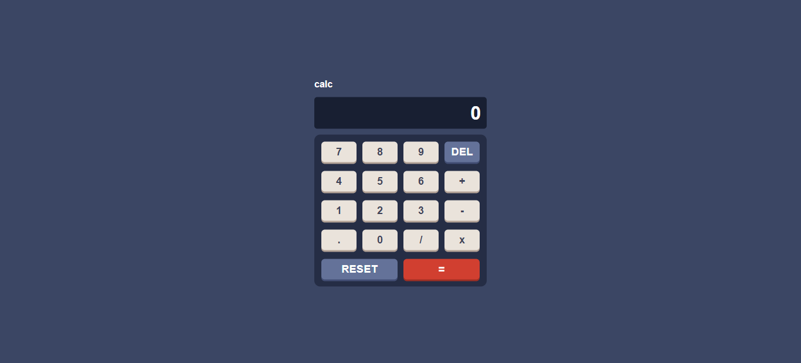

# React Calculator App

## Introduction

The React Calculator App is a web application developed using React.js. It provides a user-friendly interface for performing basic mathematical operations such as addition, subtraction, multiplication, and division.

## Usage

Once the application is running, you will see the calculator interface. Use the buttons to input numbers and perform calculations. The app supports addition, subtraction, multiplication, and division.

## Features

- User-friendly interface
- Basic arithmetic operations
- Clear button for easy input correction
- Real-time calculation display
- Responsive design for various screen sizes
